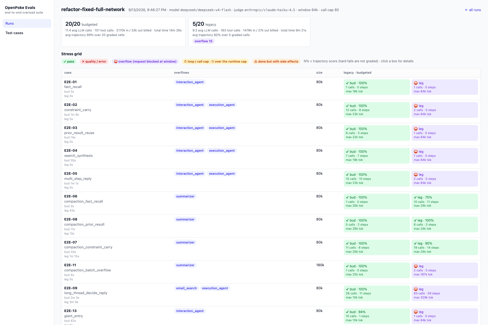

# OpenPoke 🌴

OpenPoke is a simplified, open-source take on [Interaction Company’s](https://interaction.co/about) [Poke](https://poke.com/) assistant—built to show how a multi-agent orchestration stack can feel genuinely useful. It keeps the handful of things Poke is great at (email triage, reminders, and persistent agents) while staying easy to spin up locally.

- Multi-agent FastAPI backend that mirrors Poke's interaction/execution split, powered by [OpenRouter](https://openrouter.ai/).
- Gmail tooling via [Composio](https://composio.dev/) for drafting/replying/forwarding without leaving chat.
- Trigger scheduler and background watchers for reminders and "important email" alerts.
- Next.js web UI that proxies everything through the shared `.env`, so plugging in API keys is the only setup.

## Requirements
- Python 3.10+
- Node.js 18+
- npm 9+

## Quickstart
1. **Clone and enter the repo.**
   ```bash
   git clone https://github.com/shlokkhemani/OpenPoke
   cd OpenPoke
   ```
2. **Create a shared env file.** Copy the template and open it in your editor:
   ```bash
   cp .env.example .env
   ```
3. **Get your API keys and add them to `.env`:**
   
   **OpenRouter (Required)**
   - Create an account at [openrouter.ai](https://openrouter.ai/)
   - Generate an API key
   - Replace `your_openrouter_api_key_here` with your actual key in `.env`
   
   **Composio (Required for Gmail)**
   - Sign in at [composio.dev](https://composio.dev/)
   - Create an API key
   - Set up Gmail integration and get your auth config ID
   - Replace `your_composio_api_key_here` and `your_gmail_auth_config_id_here` in `.env`
4. **(Required) Create and activate a Python 3.10+ virtualenv:**
   ```bash
   # Ensure you're using Python 3.10+
   python3.10 -m venv .venv
   source .venv/bin/activate
   
   # Verify Python version (should show 3.10+)
   python --version
   ```
   On Windows (PowerShell):
   ```powershell
   # Use Python 3.10+ (adjust path as needed)
   python3.10 -m venv .venv
   .\.venv\Scripts\Activate.ps1
   
   # Verify Python version
   python --version
   ```

5. **Install backend dependencies:**
   ```bash
   pip install -r server/requirements.txt
   ```
6. **Install frontend dependencies:**
   ```bash
   npm install --prefix web
   ```
7. **Start the FastAPI server:**
   ```bash
   python -m server.server --reload
   ```
8. **Start the Next.js app (new terminal):**
   ```bash
   npm run dev --prefix web
   ```
9. **Connect Gmail for email workflows.** With both services running, open [http://localhost:3000](http://localhost:3000), head to *Settings → Gmail*, and complete the Composio OAuth flow. This step is required for email drafting, replies, and the important-email monitor.

The web app proxies API calls to the Python server using the values in `.env`, so keeping both processes running is required for end-to-end flows.

## Project Layout

```text
server/
├── agents/
│   ├── interaction_agent/       # user-facing orchestration and worker dispatch
│   │   ├── context/             # interaction-history assembly and recall
│   │   └── tools/               # common and budgeted interaction tools
│   └── execution_agent/         # persistent workers that perform tasks
│       ├── context/             # worker history and bounded result state
│       ├── tasks/               # multi-step task implementations
│       └── tools/               # tool registry plus common/budgeted tools
├── context/                     # primitives shared by both agent types
├── routes/                      # FastAPI transport layer
├── services/                    # conversation, Gmail, trigger and roster state
└── data/                        # runtime data (ignored by git)
evals/                           # interaction and end-to-end evaluation harnesses
web/                             # Next.js client
```

The interaction agent owns conversation-level context and delegates work. Execution agents own task history and tool use. `server/context/` contains only primitives genuinely shared by both, such as bounded previews, overflow classification, and long-document digesting.

`OPENPOKE_CONTEXT_STRATEGY=legacy` keeps the original prompt behavior. The `budgeted` strategy adds bounded histories, recall/digest tools, and bounded tool results. Strategy-specific tool exposure is centralized in each agent's `tools/budgeted.py`; `tools/legacy.py` contains the common tool surface retained by both strategies. Thin modules at former import paths are temporary compatibility shims and should not receive new logic.

## Tests

Run deterministic unit tests without an LLM or external services:

```bash
python -m unittest discover -s tests -v
```

The end-to-end harness uses real agent models with an isolated fake Gmail world. To run both context strategies in parallel:

```bash
python evals/e2e/run_e2e.py --strategy both --jobs 4 --no-open
```

To browse completed runs and inspect individual cells in the Eval UI:

```bash
evals/ui/start.sh
```

Then open [http://localhost:8765](http://localhost:8765). Use `evals/ui/start.sh --dev` when working on the UI with hot reload.

[](http://localhost:8765/runs/20260913-2140-refactor-fixed-full)

See the [context-scaling final report](evals/e2e/FINAL_REPORT.md) for the problem statement, evaluation methodology,
optimization details, measured results, and future work.

## License
MIT — see [LICENSE](LICENSE).
