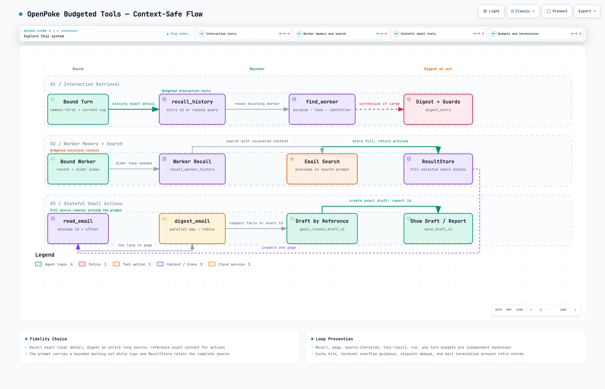

# Scaling OpenPoke Beyond the Context Window

## Executive summary

OpenPoke originally treated model context as an effectively unlimited transcript: conversation history, worker history,
email search results, worker callbacks, and the worker roster could all be copied into prompts in full. This worked on
short sessions but failed predictably once any one of those sources became large. Requests overflowed the model window,
retries repeated operations that could never fit, and exact content such as draft bodies was unnecessarily passed through
models.

We introduced a separately gated `budgeted` context strategy while preserving the original `legacy` strategy as a control.
The new path treats large text as stored data referenced from a bounded prompt. Recent and relevant context stays inline;
older or oversized content is indexed, previewed, recalled in pages, digested outside the main prompt, or passed to tools by
stable identifier.

The final process-parallel evaluation ran 20 default scenarios under both strategies:

| Strategy | Passed | Context overflows | Maximum prompt |
|---|---:|---:|---:|
| Legacy | 5/20 | 42 blocked requests across 15 scenarios | 372,228 tokens |
| Budgeted | **20/20** | **0** | **25,670 tokens** |

The final local run id is `results/20260913-2140-refactor-fixed-full`. The budgeted trajectory rubric averaged 98.9%,
with a minimum of 90%. No budgeted cell ended in an overflow, harness error, provider error, timeout, or loop. The measured
summary is included below because generated result artifacts are intentionally ignored by Git.

## Optimization tool flow

The interactive workflow focuses on the new budgeted tools rather than the full server architecture. It traces interaction
retrieval, persistent-worker recall, bounded email search backed by `ResultStore`, page and digest operations, reference-based
drafting, and the caps that terminate loops before context growth becomes unsafe. Its editable Archify source is
[`openpoke-budgeted-tools-flow.json`](../../docs/openpoke-budgeted-tools-flow.json).

## 1. The problem

An agent prompt is assembled from several independently growing sources:

1. The user's conversation history.
2. The persistent history of any execution worker.
3. Tool results, especially complete email bodies and long threads.
4. A merged callback containing results from several workers.
5. The roster of persistent workers.
6. The current user message, which may itself be a large pasted document.

The original implementation bounded none of these consistently. This created several failure modes.

### 1.1 Hard context overflow

The provider rejects a request when the complete prompt exceeds its window. The failure can occur in the interaction
agent, an execution agent, the email-search sub-agent, or even the summarizer that is supposed to reduce context.

### 1.2 Soft information loss

Simply truncating the beginning or end of a transcript avoids an exception but can silently drop the exact fact,
constraint, thread id, draft id, or user instruction needed to complete the task.

### 1.3 Retry and tool-call storms

When an oversized tool result surfaced as a generic error, agents could retry the same search with slightly different
arguments. The result was still too large, so the retry added cost and context without making progress.

### 1.4 Unnecessary model mediation

Exact content such as a long pasted document or an existing email draft does not need to be reproduced by an LLM. Passing
it through a model consumes context and risks accidental rewriting. Stable references are safer and cheaper.

### 1.5 Architecture drift

The optimizations initially accumulated in large modules with context assembly, tool schemas, runtime state, and dispatch
logic mixed together. That made the two strategies difficult to audit and made eval dependency replacement fragile.

## 2. Evaluation design

The evaluation was designed to test behavior, not merely whether a model request returned successfully.

### 2.1 Real orchestration, isolated environment

[`run_e2e.py`](run_e2e.py) calls the real `InteractionAgentRuntime`. If the interaction agent delegates work, the real
`ExecutionBatchManager` starts a real `ExecutionAgentRuntime`. When the worker batch finishes, the production callback path
creates another interaction runtime and calls `handle_agent_message`. The harness waits for those background tasks to
settle, then reads the user-visible replies from the conversation log.

The harness replaces only the environment around that orchestration:

- conversation, summary, roster, worker, and trigger stores point to a fresh temporary directory per cell;
- Gmail/Composio is replaced by a deterministic fake mailbox that records side effects;
- OpenRouter calls remain real but are wrapped for tracing, pacing, and context-window enforcement;
- cells running in parallel use separate processes so monkeypatches and process-global stores cannot race.

The FastAPI route, HTTP `202` response, frontend polling, and real Gmail network integration are not included. This is an
in-process orchestration E2E suite, not a black-box deployment test.

### 2.2 Legacy as the control

Every scenario can run under either strategy:

- `legacy` retains the original prompt behavior;
- `budgeted` enables bounded context and the additional recall/reference mechanisms.

This makes expected legacy failures useful evidence. For example, an 80k history should still overflow under legacy while
the budgeted path should complete the same user task. A refactor is considered behavior-preserving when the legacy profile
and side effects remain stable and the budgeted profile retains its improvements.

### 2.3 Scenario coverage

The 20 default scenarios cover:

- facts and standing constraints buried in conversation history;
- facts, constraints, and draft ids folded into a compacted summary;
- reuse of persistent workers and prior drafts;
- large worker histories;
- long email threads and distracting search results;
- a summarizer input that is itself too large;
- merged multi-worker callback payloads;
- one giant entry and synthesis across several giant entries;
- recall output that could overflow the caller;
- verbatim sending of a large pasted document;
- rosters containing thousands of similar workers;
- finding the correct older worker outside the recent roster slice.

`E2E-10` remains classified as a hard scenario and is excluded from the default full run unless `--include-hard` is used.

### 2.4 Success and quality signals

Each cell is evaluated at three levels:

1. Deterministic checks inspect final replies and fake-Gmail state: recipients, cc, thread and draft ids, body content,
   send count, and unexpected drafts.
2. An outcome judge evaluates whether the task was actually completed, whether the reply matches reality, and whether the
   run left harmful side effects.
3. The trajectory rubric in [`RUBRIC.md`](RUBRIC.md) grades planning, execution, observation, replanning, termination,
   duplicate work, dispatch count, and call efficiency. Eight questions are answered directly from traces.

Hard failures such as overflow, timeout, call-cap exhaustion, and harness errors skip semantic grading. This prevents an
empty blocked run from receiving a misleadingly good trajectory score.

### 2.5 Safety and reproducibility controls

The final configuration used:

| Setting | Value |
|---|---|
| Agent model | `deepseek/deepseek-v4-flash` |
| Judge model | `anthropic/claude-haiku-4.5` |
| Simulated context window | 64,000 tokens |
| Interaction history budget | 24,000 tokens |
| Summarizer batch budget | 32,000 tokens |
| Maximum LLM calls per cell | 80 |
| Runtime cap per cell | 240 seconds |
| Parallelism | 4 isolated processes |

The agent model was deliberately selected as a fast, lower-cost evaluation model. The suite makes many repeated calls while
varying the source of overload, so a cost-conscious model keeps full legacy-versus-budgeted runs practical. The aim is to
measure the context architecture and its behavioral side effects, not to rely on a more expensive model to compensate for
unbounded prompts. The separate judge model is used only after a cell completes far enough to require semantic grading.

The solution is context-window agnostic. The 64,000-token gate is the boundary chosen for this evaluation, not an assumption
baked into the context algorithms. History, entry, recall, result, turn, digest, and summarizer limits are configuration
values; they can be set with appropriate headroom below a smaller or larger model window without changing the retrieval,
digest, reference, or tool-control paths. The runtime does not need to know which provider owns the window, although the
deployment or harness must supply budgets that fit the selected model.

The context gate blocks oversized requests locally before they are billed. Traces retain component, phase, prompt estimate,
provider usage, tool calls, model response, errors, latency, and fake-Gmail calls.

## 3. Optimizations

### 3.1 Bounded interaction history

The interaction context builder fills a fixed budget newest-first. Recent entries remain inline, oversized entries become
head/tail previews, and older entries become compact index lines with stable ids. A compacted summary remains inline when
available.

This changes the prompt from “the transcript is the database” to “the prompt is a working set over durable history.”

### 3.2 Conversation recall

`recall_history` retrieves entries by stable id or ranked keyword search. Results are paged under their own token budget so
the recall tool cannot reintroduce the same overflow it was designed to solve.

### 3.3 Bounded execution-worker history

Each persistent worker now receives a recent bounded slice of its execution log plus an index of older entries.
`recall_worker_history` lets the worker recover an earlier request, action, tool result, or final response when required.

This fixed scenarios where the interaction prompt fit but a reused worker immediately overflowed on its own history.

### 3.4 Per-run result store

Full email bodies remain in a `ResultStore` owned by one execution run. The worker prompt receives bounded copies, while
stateful tools can still access the original text:

- `read_email` reads a capped page;
- `digest_email` processes the whole body outside the worker prompt;
- `gmail_create_draft_v2` resolves an exact body by reference.

Per-email, per-result, per-turn, and cumulative per-run budgets provide multiple backstops.

### 3.5 Hierarchical digest

Large documents are split into bounded chunks, mapped concurrently, and reduced into a compact answer. Several documents
are first digested separately and then reduced across documents so attribution is retained.

Digest reliability and latency were improved through:

- eight-way bounded chunk concurrency;
- a 45-second per-call timeout with retry;
- reasoning disabled for predictable chunk-read latency;
- deterministic extraction of sentences containing amounts, percentages, dates, durations, and terms such as `net-45`;
- raw-note fallbacks when a reduce call is empty or fails.

An ablation confirmed that large-entry synthesis cases fail when `digest_entry` is removed, demonstrating that the result
comes from the optimization rather than incidental model behavior.

### 3.6 Search-result controls

The email-search sub-agent receives short previews while selected full emails are returned to the caller's result store.
The budgeted path also adds:

- an id-based cache for repeated search results within a run;
- a lower search-iteration cap;
- a per-run `read_email` page cap;
- terminal overflow errors that tell the agent not to retry an operation whose size cannot fit.

For the original five-worker synthesis case, this reduced Gmail fetches from 53 to 10 and total calls from 63 to 51 during
development.

### 3.7 Bounded current-turn payloads

History budgeting alone does not protect the current message slot. A large user paste or a merged worker callback can
overflow before it becomes history. The budgeted interaction runtime therefore previews an oversized current-turn payload
and records its full text in the conversation log under a recallable entry id.

### 3.8 Turn discipline and duplicate prevention

Several control-flow guards reduce unnecessary rounds and side effects:

- `wait` ends a budgeted turn immediately;
- the same worker cannot be dispatched twice during one interaction turn;
- an acknowledgement plus successful dispatch stops further planning rounds;
- the interaction agent cannot display a newly composed draft before a worker actually creates one;
- tool-result tokens are capped cumulatively within a turn.

### 3.9 Verbatim operations by reference

Large exact content is passed by stable reference instead of being copied through prompts. Draft creation can resolve a
body directly from a conversation entry or stored email. Existing Gmail drafts are sent by draft id. This preserves exact
text, avoids model rewriting, and sharply reduces context use.

### 3.10 Compact worker roster and targeted lookup

Rendering thousands of worker names into every interaction prompt was replaced with a compact recent roster plus structured
metadata. `find_worker` searches purpose, recent tasks, counterpart names, and known identifiers so an older worker can be
reused without exposing the entire roster to the model.

## 4. Development progression

The measured progression shows which bottleneck each optimization removed:

| Stage | Result | Main observation |
|---|---:|---|
| Legacy baseline, original 10 scenarios | 0/10 | Every scenario overflowed |
| Initial budgeted strategy | 4/10 | Interaction context fit; worker history and tool results still overflowed |
| Bounded worker history | 4 newly targeted worker cases passed | Worker prompts remained around 22k tokens |
| Bounded results and digest | 2/2 targeted long-email cases passed | Removed result overflow and retry storms |
| First complete original suite | 10/10 | All original overload axes completed |
| Expanded pre-refactor suite | 19/20 | One nondeterministic quality miss, no systemic overflow regression |
| Final post-refactor suite | **20/20 budgeted** | Zero budgeted context overflows |

Intermediate artifacts are retained under `evals/e2e/results/` locally. The progression and important run ids are also
recorded in [`PLAN.md`](PLAN.md).

## 5. Final results

### 5.1 Outcome profile

The final run contained 40 cells: 20 scenarios under each strategy.

| Metric | Legacy | Budgeted |
|---|---:|---:|
| Passed scenarios | 5 | **20** |
| Failed scenarios | 15 | **0** |
| Scenarios failing from overflow | 15 | **0** |
| Blocked requests | 42 | **0** |
| Maximum prompt | 372,228 | **25,670** |
| Average trajectory score when graded | 89.6% | **98.9%** |

Legacy passed the five cases where count-based compaction or a smaller prompt happened to keep the request under the
window: E2E-06, E2E-07, E2E-08, E2E-19, and E2E-21. Its other 15 scenarios reproduced the expected context-overflow
profile. This matched the preceding full legacy run exactly at the outcome level.

Budgeted passed every default case. Its only outcome change from the preceding full budgeted run was an improvement:
E2E-03 moved from a quality miss to a pass.

### 5.2 Efficiency on comparable successful work

Totals across all 20 cases are not a fair efficiency comparison because legacy aborts early in 15 cases while budgeted
actually completes them. A useful comparison is the five scenarios both strategies completed:

| Metric on the five shared successes | Legacy | Budgeted | Reduction |
|---|---:|---:|---:|
| LLM calls | 49 | 28 | **43%** |
| Input tokens | 894,403 | 372,840 | **58%** |
| Gmail calls | 17 | 5 | **71%** |

The largest improvement is visible in the roster cases. Budgeted selected or found the relevant worker from a small roster
representation rather than repeatedly sending thousands of names through the model.

## 6. Limitations

- Model-backed evaluations are nondeterministic. Repeated runs and deterministic final-state checks remain necessary.
- The token gate uses the harness's estimate before the provider reports exact usage.
- Fake Gmail validates agent decisions and arguments but cannot reproduce every Composio or Gmail API behavior.
- Process-parallel evals divide an RPM allowance among workers; they do not share one global cross-process rate limiter.
- The suite bypasses FastAPI, HTTP lifecycle behavior, frontend polling, server restarts, and real deployment concurrency.
- Result artifacts are intentionally ignored by Git, so reported run ids require retaining or publishing the local artifacts
  separately.

## 7. Future optimization opportunities

### Priority 1: durable indexed recall

`recall_history` and `recall_worker_history` currently load log entries and perform in-memory keyword matching. Move logs to
a durable indexed store:

1. SQLite with FTS for bounded lexical retrieval.
2. Structured filters for tags, timestamps, worker, counterpart, thread id, and draft id.
3. Embedding/vector retrieval for paraphrases after measuring where lexical search fails.

Retrieval should operate over bounded result sets so a large history is never loaded merely to search it.

### Priority 2: structured constraint memory

Extract durable user rules—required cc recipients, approval requirements, tone, account preferences—into a small structured
constraint store. Keep active constraints inline and attach provenance back to the original conversation entry. This makes
critical rules independent of summarizer wording and of the model realizing that it should search history.

### Priority 3: one executable registry invariant

Stateful tools such as `read_email`, `digest_email`, and `gmail_create_draft_v2` are exposed through the budgeted schema
registry but executed specially by the runtime because they need a per-run `ResultStore`. Introduce a per-run tool session
that binds this state and produces both schemas and callables. Then enforce:

> Every schema exposed to a model has exactly one executable handler with the same name.

### Priority 4: black-box server evaluation

Add a smaller deployment-level suite that starts the ASGI application, posts to `/chat/send`, verifies the `202` contract,
polls `/chat/history`, and observes the worker callback across the HTTP boundary. Include restart and overlapping-user-turn
cases to test task lifetime and singleton behavior that the in-process harness does not cover.

### Priority 5: shared parallel rate limiting and cost accounting

Replace per-process RPM splitting with a shared limiter or central request broker. Record provider cost alongside tokens and
set per-run budget thresholds, making latency/cost regressions visible in the same report as correctness.

### Priority 6: retrieval and digest robustness

Expand deterministic tests and eval cases for:

- multilingual and paraphrased recall;
- tables, HTML email, attachments, and malformed threads;
- conflicting numbers across revisions;
- exact quotation and byte-preserving operations;
- digest partial failure, timeout, and retry behavior;
- very large multi-document comparisons.

## Conclusion

The central improvement is not a larger context window; it is a different relationship with context. Prompts now carry a
bounded working set, while durable logs and tool-result stores retain the complete source material. Agents can retrieve,
digest, or reference that material according to the task's fidelity requirements.

That design converted the expanded overload suite from 5/20 under the legacy strategy to 20/20 under the budgeted strategy,
eliminated budgeted context overflows, reduced work substantially on directly comparable successes, and left the original
strategy available as a stable control.
